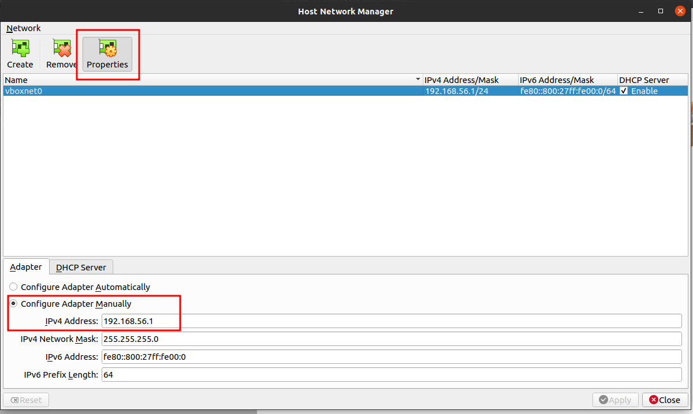
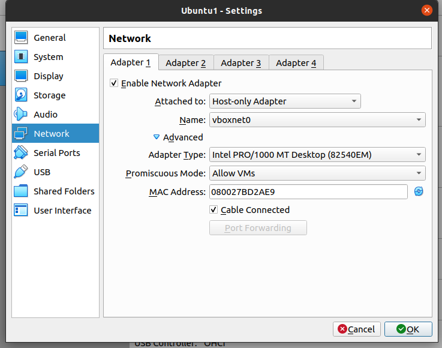
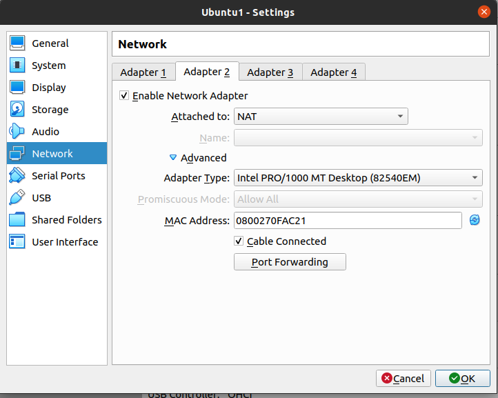

## virtualbox

### 双网络设置
配置可以同时支持 NAT 网络和 Host 网络的虚拟机网络。
##### 科普
简要介绍两种网络：
> Network Address Translation (NAT). If all you want is to browse the Web, download files, and view email inside the guest, then this default mode should be sufficient for you, and you can skip the rest of this section. Please note that there are certain limitations when using Windows file sharing. 

> Host-only networking. This can be used to create a network containing the host and a set of virtual machines, without the need for the host's physical network interface. Instead, a virtual network interface, similar to a loopback interface, is created on the host, providing connectivity among virtual machines and the host.

Reference：[Chapter 6. Virtual Networking](https://www.virtualbox.org/manual/ch06.html)

##### 为什么？
宿主机代理程序代理整个虚拟机网络，同时在本地网络中创建虚拟机网络 IP，方便虚拟机连接外网以及宿主机访问。
##### 例子
背景：在宿主机上部署了代理程序 [Clash](https://github.com/Dreamacro/clash)。  
* 虚拟机单独设置为 NAT 网络时，可以访问外网，虚拟系统和虚拟机软件均被看作是宿主机的一个软件，走宿主机设置的系统代理，整个虚拟系统发出的流量被 Clash 代理，在终端下`curl google.com`会得到有效相应，达到虚拟机走透明代理的效果，但是这样无法被宿主机直接 SSH 访问机器。  
* 虚拟机单独设置为 HOST 网络时，通过创建在宿主机的虚拟网卡与宿主机处于同一局域网中，无法访问外网，此时代理工具是宿主机上的一个程序，自然无法直接被虚拟机访问，需要开启代理程序局域网代理功能，并且在虚拟系统内设置代理指向代理程序的服务端口，步骤较为复杂。  

双网卡设置可以解决上述问题。

#### 操作记录
本操作基于：
* 宿主机 Ubuntu 20.04
* 宿主机 Virtualbox 版本 6.1
* 虚拟系统 Ubuntu 20.04

**请注意不同系统和软件有不同的操作方法。**

##### Step 1: 新建 Host 网络
Virtualbox > File > Host Network Manager
点击 `Create` 创建Host网络并且点击`Properties`设置，这里需要留意生成出来的网段。

##### Step 2: 虚拟机配置两种网络
进入虚拟机设置，点击 `Network` 进行网卡设置。如下图。
理论来说两者顺序无关，我推荐将Host网络放到首位，系统会默认识别第一个网卡，方便宿主机直接SSH IP进去。



##### Step 3: 虚拟机内部设置
进入虚拟机，查看系统是否识别2个网卡。其中 `enp0s3`，`enp0s8`分别是设置的2个网卡。
```shell
ubuntu@ubuntu:~$ ls /sys/class/net
docker0  enp0s3  enp0s8  lo
```
此时`ifconfig`查看全部网卡，**如果出现了两个网卡则不需要进行下面的步骤**，我在测试的时候是只有第一个网卡`enp0s3`。  

接下来手动编辑网络设置。

:::tip

需要注意的是[netplan](https://netplan.io/) 是在 Ubuntu 18.04 LTS 后新的网络设置，如果是之前的系统版本，下面的方法并不适用。他的工作原理是:
> Netplan reads network configuration from /etc/netplan/*.yaml which are written by administrators, installers, cloud image instantiations, or other OS deployments. During early boot, Netplan generates backend specific configuration files in /run to hand off control of devices to a particular networking daemon.
:::

```shell
sudo vim /etc/netplan/00-installer-config.yaml
```
```yaml
network:
  ethernets:
    enp0s3:                        # Host 网卡
      addresses: [192.168.56.3/24] # 手动注册地址 注意网段和Step 1中的适配
    enp0s8:                        # NAT 网卡
      dhcp4: true
  version: 2
```
设置完成后执行 `sudo netplan apply` 生效。

##### Step 4: 验证

```shell
ubuntu@ubuntu:~$ ifconfig enp0s3
enp0s3: flags=4163<UP,BROADCAST,RUNNING,MULTICAST>  mtu 1500
        inet 192.168.56.3  netmask 255.255.255.0  broadcast 192.168.56.255
......
ubuntu@ubuntu:~$ ifconfig enp0s8
enp0s8: flags=4163<UP,BROADCAST,RUNNING,MULTICAST>  mtu 1500
        inet 10.0.3.15  netmask 255.255.255.0  broadcast 10.0.3.255
```